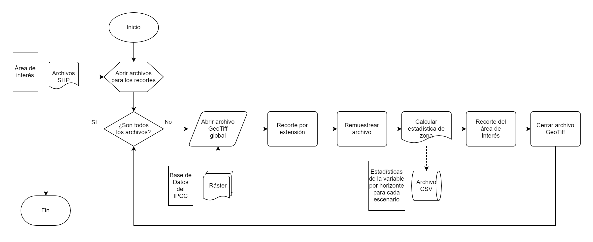

# ipcc-pyqgis

Script para QGis 3.16+, escrito en Python para el procesamiento de un gran volumen de imágenes ráster.

Este script fue elaborado por Juan Pablo Báez Vásquez como parte de la "*Breve Guía para la Selección, Descarga y Aplicación de Escenarios de Cambio Climático para México. De acuerdo con los últimos escenarios del IPCC*" que puede consultarse en [http://dx.doi.org/10.13140/RG.2.2.20064.15369](http://dx.doi.org/10.13140/RG.2.2.20064.15369 "Guía de Escenarios de Cambio Climático CMIP6. Tres Estudios de Caso"). En el Anexo 2 de esta guía encontrará los detalles para su uso.

## Resumen
Los interesados en trabajar con los escenarios más recientes de cambio climático publicados en el reporte del **Grupo de Trabajo I del IPCC al Sexto Informe de Evaluación**, muchas veces hacen uso de las bases de datos públicas disponibles en sitios como [WordClim](https://www.worldclim.com "WorldClim"), el [Atlas interactivo el IPCC](https://interactive-atlas.ipcc.ch "IPCC WGI Interactive Atlas"), o [UNIATMOS](http://uniatmos.atmosfera.unam.mx/AR6/visualizador "Escenarios de cambio climático regionalizados CORDEX, AR6, IPCC").

Lo anterior implica trabajar con una gran cantidad de imágenes, es entonces donde el uso del script **ipcc-pyqgis** facilita el trabajo permite realizarlo de manera más ágil.

## Procesamiento de imágenes GeoTiff con QGis

En la siguiente figura se muestran los pasos realizados por **ipcc-pyqgis**:

Para iniciar con el procesamiento de las imágenes, siga estos pasos:

1. Descargue y guarde todas las imágenes de proyecciones de cambio climático en un único subdirectorio (variable dGlob)
2. Descargue el archivo del script: *ipcc-pyqgis.py*
3. Abra la *Consola de Python* desde QGis mediante el menú *Complementos > Consola de Python* o simplemente presione *Ctrl+Alt+P*
4. En la ventana que se muestra, abra el *Editor* de Python y en seguida use el menú correspondiente para abrir el script
5. En el código del script, busque y personalice las *variables globales* (véase el Anexo 2 de la guía mencionada). Use las variables *rcSHP* y *rcSHP_ext* para proveer un polígono que represente el área geográfica de interés (en la carpeta *shp* de este repositorio encontrará un ejemplo).
6. En la barra de menú del *Editor* de Python, de clic en el botón *Ejecutar* (Run).
7. En el explorador de archivos vaya al subdirectorio que indicó como salida de las imágenes (dOutput)

### Salida del script
Una vez que se terminen de procesar todas las imágenes encontrará un archivo *.tiff* para cada una de ellas con el recorte del área geográfica proporcionada; también hallará varios archivos de texto (*.txt*) con el resumen de las estadísticas de zona de la misma área. Para una mejor visualización de las estadísticas, se recomienda importar los archivos *.txt* desde un editor de hojas de cálculo.

En la carpeta *dOutput* de este repositorio encontrará un ejemplo de la salida este script. 

## Forma sugerida de citar la Guía

Ruiz-García, P., Monterroso-Rivas, A.I., Sánchez-Torres G., Vargas-Castilleja, R.C., Báez-Vásquez, J. & Conde-Álvarez, A.C (2022). Breve Guía para la Selección, Descarga y Aplicación de Escenarios de Cambio Climático para México. De acuerdo con los últimos escenarios del IPCC. UACh-UNAM-BUAP-UAT-ISF-México, A.C. 98 p. http://cirenam.chapingo.mx/cambio-climatico/folletos/

## Forma sugerida para citar el script

Báez-Vázquez, J. P. (2022). Script para QGis 3.16+, escrito en Python para el procesamiento de un gran volumen de imágenes ráster. En: Breve Guía para la Selección, Descarga y Aplicación de Escenarios de Cambio Climático para México. De acuerdo con los últimos escenarios del IPCC. UACh-UNAM-BUAP-UAT-ISF-México, A.C. 98 p. http://cirenam.chapingo.mx/cambio-climatico/folletos/